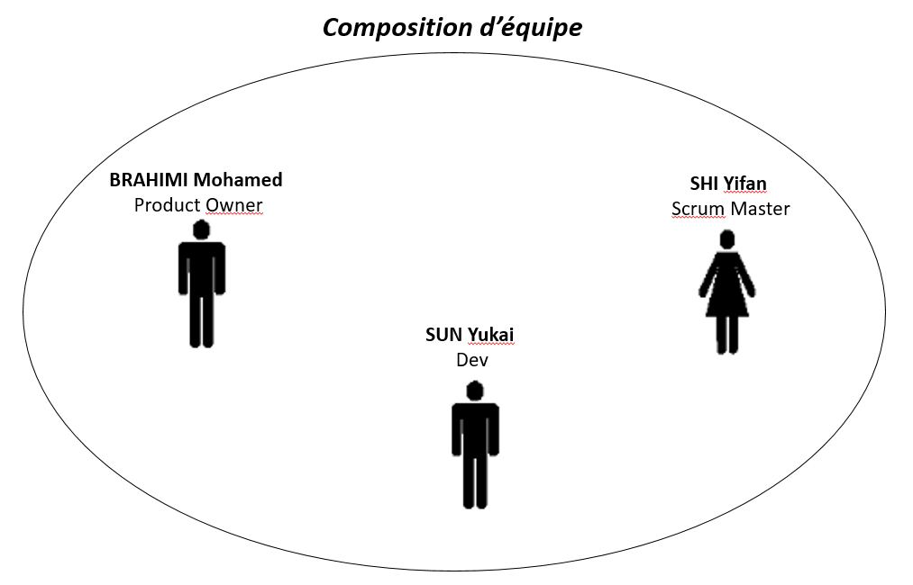

# Synthèse du projet

## Nom du projet

LOVERICE

## Description

Loverice est un site Web qui compare pour vous les prix entre un même produit pour trouver le meilleur choix possible parmi une sélection destinée à vous plaire.

Vous cochez différents thèmes avec un maximum de 3 thèmes et LOVERICE vous proposera par la suite 2 produits par thème qui auront été comparés pour vous et qui vous éviterons de chercher une idée ou tout simplement le prix le plus bas.

## Membres de l'équipe et répartition des rôles

Notre équipe compte trois personnes, les rôles de Product Owner et de Scrum Master peuvent changer au cours du projet.

## Lien vers le kanban board 
//TODO: Mets le lien ici

## Lien vers le dossier Google Drive 

(les documents relatifs au projet)

https://drive.google.com/drive/folders/1lqwa6XtWTup2IvWwN5K8llbz97geZGaE?usp=sharing 
